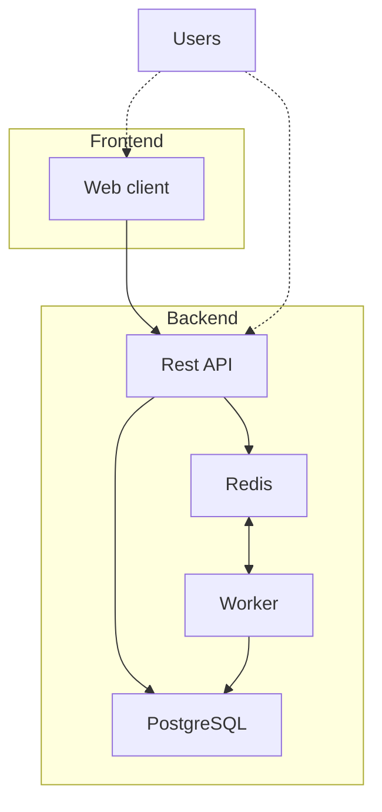

<!-- doc-covers: dev/cli dev/setup-environment server/pyproject.toml -->
<!-- doc-verified: 6e0c70e -->

# Development

Outception's stack consists of the following elements:

- A backend written in Python, exposing a REST API and a worker
- A web app and a mobile app, sharing one client domain layer
- A PostgreSQL database
- A Redis database



## Quick start with `dev`

We have an internal tool in place called `dev` for an easy setup:

```sh
./dev/cli/install              # One-time setup to add the 'dev' alias (restart your terminal after)
dev up                         # Sets up the entire environment
```

The `dev up` command will:

- Install missing prerequisites (Homebrew, Docker, uv, pnpm, Node.js)
- Generate environment files and start the infrastructure (PostgreSQL, Redis)
- Install Python and JS dependencies, builds packages
- Run database migrations and builds email templates and backoffice

After `dev up` completes, start the services you need:

```sh
dev api              # Start backend API server (http://127.0.0.1:8000)
dev worker           # Start background job worker
dev web              # Start frontend Next.js dev server (http://127.0.0.1:3000)
```

Running `dev up` after pulling new code is also recommended to make sure dependencies and DB migrations are up-to-date.

## Setup environment variables

For the Outception stack to run properly, it needs quite a bunch of settings defined as environment variables. To ease things, we provide a script to bootstrap them. It requires [uv](https://docs.astral.sh/uv/getting-started/installation/) to be installed on your system.

```sh
./dev/setup-environment
```

Once done, the script will automatically create `server/.env` and `clients/apps/web/.env.local` files from the `.env.example` files beside them with the necessary environment variables.

**Shared secrets (multi-worktree development)**

If you work with multiple Git worktrees, secrets are automatically shared via `~/.config/outception/secrets.env`:

1. Run `./dev/setup-environment` in your first worktree
3. Run `./dev/setup-environment` in each additional worktree - secrets are merged automatically

You can override the secrets file location with `OUTCEPTION_SECRETS_FILE` environment variable.

### Setup backend

Setting up the backend consists of basically three things:

**1. Start the development containers**

This will start PostgreSQL, Redis and Minio (S3 storage) containers. You'll need to have [Docker](https://docs.docker.com/get-started/) installed.

```sh
cd server
```

```sh
docker compose up -d
```

**2. Install Python dependencies**

We use [uv](https://docs.astral.sh/uv/) to manage our Python dependencies. Make sure it's installed on your system.

```sh
uv sync
```

### Setup frontend

**1. Install JavaScript dependencies**

We use [pnpm](https://pnpm.io/installation) to manage our JavaScript dependencies. Make sure it's installed on your system.

```sh
cd clients
```

```sh
pnpm install
```

## Start environment

> [!TIP]
> Use several terminal tabs to run things in parallel.

### Start backend

The backend consists of an API server and a worker. You can run them like this:

```sh
cd server
```

**1. Build email binary**

```sh
uv run task emails
```

> [!NOTE]
> If you're in local development, you should build the email renderer binary, as it's required for first time.

**2. Apply the database migrations**

```sh
uv run task db_migrate
```

> [!NOTE]
> You don't necessarily need to run it each time you start the server, but it's a good idea to regularly do it nonetheless.

**3. Start server and workers**

```sh
uv run task api
```

```sh
uv run task worker
```

By default, the API server will be available at [http://127.0.0.1:8000](http://127.0.0.1:8000).

> [!TIP]
> The processes will restart automatically if you make changes to the code.

### Start frontend

The frontend mainly consists of a web client server, plus other projects useful for testing or examples. You can run them like this:

```sh
cd clients
```

```sh
pnpm dev
```

By default, the web client will be available at [http://127.0.0.1:3000](http://127.0.0.1:3000).

> [!TIP]
> The processes will restart automatically if you make changes to the code.

## Running the tests

The test suites don't need the API, worker or web processes running — only the Docker services
and the setup from the sections above.

### Backend

From `server/`:

```sh
uv run task test_fast    # parallel, no coverage
uv run task lint         # ruff, auto-fixing
uv run task lint_types   # mypy
```

Or a single path: `OUTCEPTION_ENV=testing uv run python -m pytest tests/<module>`.

`uv run task test` adds coverage and runs serially, so prefer `test_fast` locally. CI does
neither — it shards `pytest ... -n auto --no-cov` across four jobs. Tests read the committed
`server/.env.testing` (forced by `tests/conftest.py`), not `server/.env`, and each xdist worker
gets its own `outception_test_<worker_id>` database. Export `OUTCEPTION_TEST_DATABASE_TEMPLATE=outception_test` — with
`outception_test` created and migrated — to have workers clone that database instead of replaying
every migration; refresh it with `OUTCEPTION_ENV=testing uv run task db_migrate` whenever you add a
migration.

Redis is not required: tests substitute a fake Redis. PostgreSQL is required.

The other server gates CI runs, from `server/`:

```sh
uv run python -m scripts.check_env_vars              # the env contract
uv run task check_migrations                         # one head, later filename
uv run python -m scripts.linters.names --strict      # no third party named
uv run python -m evals.run --suite scrub             # the evals gate
```

### Frontend

From `clients/`:

```sh
pnpm lint
pnpm typecheck
pnpm test --filter web   # scope with --filter
pnpm exec tsx scripts/check-names.ts --strict   # no third party named
pnpm exec tsx scripts/sync-skills.ts --check    # the bundled skills match skills/
pnpm --filter web exec next build --turbopack && pnpm exec tsx scripts/check-budget.ts
cd apps/app && npx expo-doctor
```

Unit tests need neither the backend nor `.env.local`. From the repository root,
`node scripts/check-doc-freshness.mts --check` verifies that every spec under `docs/` is
still fresh against the paths it covers.

### Hooks

Staged-file hooks mirror the gates. Install them once:

```sh
cd clients && pnpm exec lefthook install
```

## Docker-Based Development (Alternative)

For a fully containerized development environment with hot-reloading, you can use the Docker-based setup. This is useful for:

- Running multiple isolated instances for testing
- Consistent environments across different machines
- AI agents that need isolated development environments

### Quick Start

```sh
dev docker up
```

This single command will:

1. Build the necessary Docker images
2. Start PostgreSQL and Redis
3. Install Python and Node.js dependencies
4. Run database migrations
5. Start the API server, worker, and web frontend with hot-reloading

### Access Points

| Service      | URL                   |
| ------------ | --------------------- |
| Web Frontend | http://localhost:3000 |
| API Server   | http://localhost:8000 |

Run `dev docker ports` to see instance-specific ports and URLs.

### Common Commands

```sh
# Start in background (detached mode)
dev docker up -d

# View logs
dev docker logs

# View logs for specific service
dev docker logs api

# Stop all services
dev docker down

# Rebuild images
dev docker build

# Open shell in container
dev docker shell api

# Include monitoring (Prometheus + Grafana)
dev docker up --monitoring
```

### Running Multiple Instances

For parallel development or testing, you can run multiple isolated instances:

```sh
# Instance 0 (default): API on 8000, Web on 3000
dev docker up -d

# Instance 1: API on 8101, Web on 3101
dev docker up -i 1 -d

# Instance 2: API on 8102, Web on 3102
dev docker up -i 2 -d
```

Each instance has its own:

- Docker containers and networks
- PostgreSQL database (`outception_dev_<N>`)
- Redis database index (`<N>`)

### Port Mapping

Only API and Web have host ports. PostgreSQL and Redis run in a shared
project with no host ports — reach them via `dev docker exec <service>`.

| Service | Instance 0 | Instance 1 | Instance 2 |
| ------- | ---------- | ---------- | ---------- |
| API     | 8000       | 8101       | 8102       |
| Web     | 3000       | 3101       | 3102       |

Run `dev docker ports` to see resolved ports for the current worktree.

### Hot-Reloading

The Docker setup supports hot-reloading:

- **Backend (API)**: Uses uvicorn with `--reload` flag
- **Backend (Worker)**: Uses dramatiq with `--watch` flag
- **Frontend (Web)**: Uses Next.js with Turbopack

Code changes on your host machine are immediately reflected in the running containers.

### Configuration

The Docker environment uses `dev/docker/.env.docker` for configuration. To customize:

```sh
# Copy template (done automatically on first run)
cp dev/docker/.env.docker.template dev/docker/.env.docker

# Edit as needed
vim dev/docker/.env.docker
```

> [!NOTE]
> The Docker-based setup is additive. The traditional host-based development workflow (`docker compose up -d` + `uv run task api`) continues to work as before.

## Login using email

To log in for the first time, follow these steps:

1. Navigate to the login page.
2. Enter your email address in the provided field.
3. Click the "Login" button.
5. Check the terminal where the API is running (`uv run task api`) to get the OTP code.
6. Enter the OTP code in the login form.

